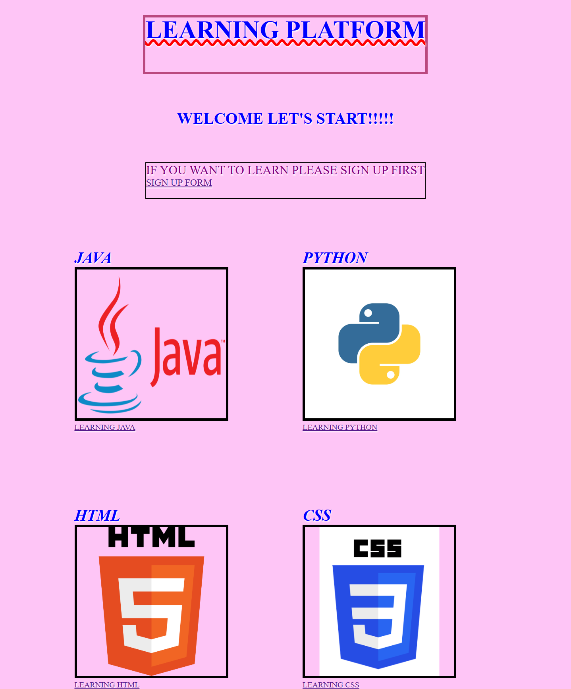

# Learning Platform(practice project)
A basic layout for an online learning platform built using HTML, CSS, and a bit of JavaScript. This project was created as a frontend practice.

✨ Features~
- Homepage layout for a learning site. 
- Course cards or sections.
- Basic button or link structure. 

🛠 Tech Used~
- HTML  
- CSS  

🖼 Screenshot~

🚀 How to Run~
1. Download or clone the repo.
2. Open index.html in your browser.

📌 Project Status~
✅ Completed (basic version for learning & practice).
